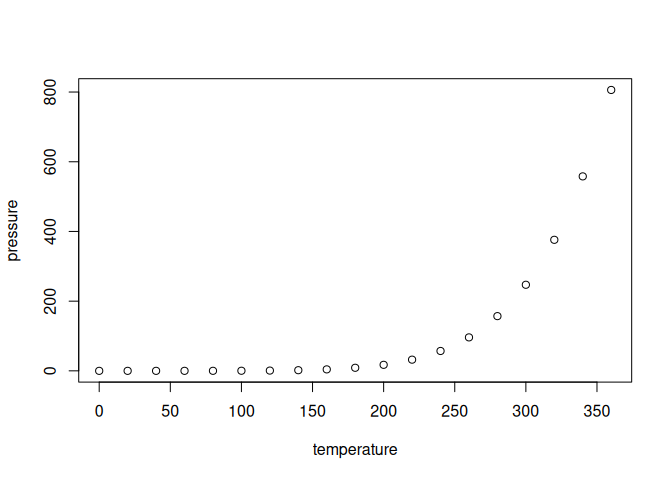

<!-- README.md is generated from README.Rmd. Please edit that file -->

# daa

<!-- badges: start -->

[](https://github.com/microbiome/daa/issues)
[](https://github.com/microbiome/daa/pulls)
[](https://lifecycle.r-lib.org/articles/stages.html#experimental)
[](https://bioconductor.org/checkResults/release/bioc-LATEST/daa)
[](https://bioconductor.org/checkResults/devel/bioc-LATEST/daa)
[](http://bioconductor.org/packages/stats/bioc/daa/)
[](https://support.bioconductor.org/tag/daa)
[](https://bioconductor.org/packages/release/bioc/html/daa.html#since)
[](http://bioconductor.org/checkResults/devel/bioc-LATEST/daa/)
[](https://bioconductor.org/packages/release/bioc/html/daa.html#since)
[](https://github.com/microbiome/daa/actions/workflows/check-bioc.yml)
[](https://app.codecov.io/gh/microbiome/daa)
<!-- badges: end -->

The goal of `daa` is to provide method for differential abundance
analysis (DAA).

## Installation instructions

Get the latest stable `R` release from
[CRAN](http://cran.r-project.org/). Then install `daa` from
[Bioconductor](http://bioconductor.org/) using the following code:

``` r
if (!requireNamespace("BiocManager", quietly = TRUE)) {
    install.packages("BiocManager")
}

BiocManager::install("daa")
```

And the development version from
[GitHub](https://github.com/microbiome/daa) with:

``` r
BiocManager::install("microbiome/daa")
```

## Example

This is a basic example which shows you how to solve a common problem:

``` r
library("daa")
## basic example code
```

What is special about using `README.Rmd` instead of just `README.md`?
You can include R chunks like so:

``` r
summary(cars)
#>      speed           dist       
#>  Min.   : 4.0   Min.   :  2.00  
#>  1st Qu.:12.0   1st Qu.: 26.00  
#>  Median :15.0   Median : 36.00  
#>  Mean   :15.4   Mean   : 42.98  
#>  3rd Qu.:19.0   3rd Qu.: 56.00  
#>  Max.   :25.0   Max.   :120.00
```

You’ll still need to render `README.Rmd` regularly, to keep `README.md`
up-to-date.

You can also embed plots, for example:



In that case, don’t forget to commit and push the resulting figure
files, so they display on GitHub!

## Citation

Below is the citation output from using `citation('daa')` in R. Please
run this yourself to check for any updates on how to cite **daa**.

``` r
print(citation("daa"), bibtex = TRUE)
#> To cite package 'daa' in publications use:
#> 
#>   Borman T, Lahti L (2025). _daa: Differential abundance analysis_. R
#>   package version 0.99.0, <https://github.com/microbiome/daa>.
#> 
#> A BibTeX entry for LaTeX users is
#> 
#>   @Manual{,
#>     title = {daa: Differential abundance analysis},
#>     author = {Tuomas Borman and Leo Lahti},
#>     year = {2025},
#>     note = {R package version 0.99.0},
#>     url = {https://github.com/microbiome/daa},
#>   }
```

Please note that the `daa` was only made possible thanks to many other R
and bioinformatics software authors, which are cited either in the
vignettes and/or the paper(s) describing this package.

## Code of Conduct

Please note that the `daa` project is released with a [Contributor Code
of Conduct](http://bioconductor.org/about/code-of-conduct/) By
contributing to this project, you agree to abide by its terms.

## Development tools

- Continuous code testing is possible thanks to [GitHub
  actions](https://www.tidyverse.org/blog/2020/04/usethis-1-6-0/)
  through *[usethis](https://CRAN.R-project.org/package=usethis)*,
  *[remotes](https://CRAN.R-project.org/package=remotes)*, and
  *[rcmdcheck](https://CRAN.R-project.org/package=rcmdcheck)* customized
  to use [Bioconductor’s docker
  containers](https://www.bioconductor.org/help/docker/) and
  *[BiocCheck](https://bioconductor.org/packages/3.22/BiocCheck)*.
- Code coverage assessment is possible thanks to
  [codecov](https://codecov.io/gh) and
  *[covr](https://CRAN.R-project.org/package=covr)*.
- The [documentation website](http://microbiome.github.io/daa) is
  automatically updated thanks to
  *[pkgdown](https://CRAN.R-project.org/package=pkgdown)*.
- The code is styled automatically thanks to
  *[styler](https://CRAN.R-project.org/package=styler)*.
- The documentation is formatted thanks to
  *[devtools](https://CRAN.R-project.org/package=devtools)* and
  *[roxygen2](https://CRAN.R-project.org/package=roxygen2)*.

For more details, check the `dev` directory.

This package was developed using
*[biocthis](https://bioconductor.org/packages/3.22/biocthis)*.
